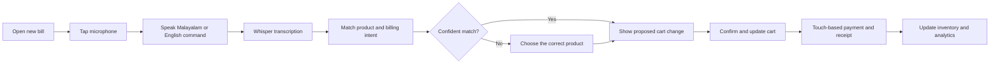

# RetailMind AI

RetailMind AI is a mobile-first retail management app for small businesses. It combines fast billing, inventory management, sales analytics, and a simple business dashboard in one place.

The first release is designed for Malayalam- and English-speaking retailers, with voice assistance focused exclusively on the billing experience.

## Key features

- **Fast billing:** Create a bill by speaking several products and quantities at once.
- **Voice-assisted billing:** Speak short Malayalam or English commands to add, remove, search for, or change the quantity of products in the active bill.
- **Multilingual experience:** Malayalam and English interface and product-name support.
- **Inventory management:** Automatically reduce stock after a completed sale and surface low-stock alerts.
- **Sales analytics:** Track sales, popular products, payment methods, and business trends.
- **Business dashboard:** See today's sales, important inventory alerts, and quick actions at a glance.

## Voice billing

Voice input is available only on the **New Bill** screen. Before recording, the shopkeeper sees only one meaningful action: start recording. All correction controls appear only after a draft bill has been generated.

Example commands:

- `രണ്ട് പാൽ ചേർക്കൂ` — Add 2 milk items
- `ഒരു ബ്രെഡ് ഒഴിവാക്കൂ` — Remove 1 bread item
- `പഞ്ചസാര മൂന്ന് ആക്കൂ` — Set sugar quantity to 3
- `സോപ്പ് കാണിക്കൂ` — Search for soap

### Voice workflow

1. The shopkeeper opens a new bill and taps the microphone.
2. They speak a short product command in Malayalam or English.
3. OpenAI Whisper converts speech to text.
4. RetailMind separates the spoken items, matches them against the store's product catalogue and aliases, and fetches their stored prices.
5. The proposed bill is shown for confirmation.
6. If an item is incorrect, the shopkeeper enters correction mode and changes only that item.
7. The cart and total update after confirmation; payment and receipt sharing remain touch-based.

For better recognition, products should support Malayalam names, English names, and local spoken aliases. For example, `പാൽ`, `milk`, and `paal` can identify the same product.

## Technology direction

- **Platform:** Mobile-first application
- **Speech-to-text:** OpenAI `whisper-1` transcription model
- **Voice languages:** Malayalam (`ml`) and English (`en`)
- **Core modules:** Billing, inventory, analytics, and business dashboard

When the spoken language is known, the app can pass `ml` or `en` with the transcription request to improve recognition. For mixed Malayalam-English speech, it can use language detection. The app should always display the transcript and proposed bill change before applying it.

## Product workflow

## MVP scope

1. Malayalam and English UI support.
2. Product catalogue with multilingual names, aliases, and database-owned prices.
3. Push-to-talk voice billing on the New Bill screen.
4. Processing and editable draft-bill confirmation screens.
5. Touch confirmation before applying voice-driven cart changes.
6. Inventory deduction, low-stock alerts, receipts, and basic sales reports.

## Current implementation

The Flutter app currently includes the voice-first billing journey using a local product catalogue and a simulated transcription result:

1. Home screen with one **New Bill** action.
2. Minimal recording screen with a start/stop voice toggle.
3. Processing screen after recording stops.
4. Draft bill generated from structured product-and-quantity results.
5. Optional correction mode to remove items, adjust quantities, or add a missed catalogue item.

Audio capture, OpenAI Whisper transcription, a persistent product database, payment, and inventory updates are the next integration stages.

## Security

The app blocks cleartext network traffic on Android and keeps iOS App Transport Security enabled. API keys and other secrets are excluded from Git and must never be shipped in the mobile app. Future voice transcription will go through a RetailMind backend, which securely holds the OpenAI key and returns only a validated draft bill to the device. See [the security baseline](docs/security.md) for the required controls and future protocol.

## Codex contribution

This project is being developed with assistance from OpenAI Codex. Codex has helped translate the product workflow into the Flutter foundation, create the initial voice-billing screens and tests, and maintain this README as the implementation evolves. Product requirements, business decisions, and final review remain with the project owner.
