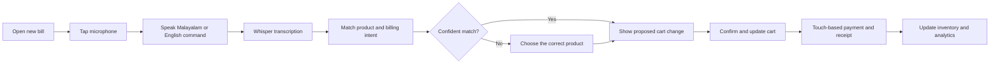

# RetailMind AI

RetailMind AI is a mobile-first retail management app for small businesses. It combines fast billing, inventory management, sales analytics, and a simple business dashboard in one place.

The first release is designed for Malayalam- and English-speaking retailers, with voice assistance focused exclusively on the billing experience.

## Key features

- **Fast billing:** Add products, adjust quantities, and complete a bill from a mobile device.
- **Voice-assisted billing:** Speak short Malayalam or English commands to add, remove, search for, or change the quantity of products in the active bill.
- **Multilingual experience:** Malayalam and English interface and product-name support.
- **Inventory management:** Automatically reduce stock after a completed sale and surface low-stock alerts.
- **Sales analytics:** Track sales, popular products, payment methods, and business trends.
- **Business dashboard:** See today's sales, important inventory alerts, and quick actions at a glance.

## Voice billing

Voice input is available only on the **New Bill** screen. This keeps the most frequent retail task fast while retaining touch-based confirmation for sensitive actions such as payment, discounts, refunds, and final checkout.

Example commands:

- `രണ്ട് പാൽ ചേർക്കൂ` — Add 2 milk items
- `ഒരു ബ്രെഡ് ഒഴിവാക്കൂ` — Remove 1 bread item
- `പഞ്ചസാര മൂന്ന് ആക്കൂ` — Set sugar quantity to 3
- `സോപ്പ് കാണിക്കൂ` — Search for soap

### Voice workflow

1. The shopkeeper opens a new bill and taps the microphone.
2. They speak a short product command in Malayalam or English.
3. OpenAI Whisper converts speech to text.
4. RetailMind matches the text against the store's product catalogue and aliases.
5. The proposed cart update is shown for confirmation.
6. The cart and total update after confirmation; payment and receipt sharing remain touch-based.

For better recognition, products should support Malayalam names, English names, and local spoken aliases. For example, `പാൽ`, `milk`, and `paal` can identify the same product.

## Technology direction

- **Platform:** Mobile-first application
- **Speech-to-text:** OpenAI `whisper-1` transcription model
- **Voice languages:** Malayalam (`ml`) and English (`en`)
- **Core modules:** Billing, inventory, analytics, and business dashboard

When the spoken language is known, the app can pass `ml` or `en` with the transcription request to improve recognition. For mixed Malayalam-English speech, it can use language detection. The app should always display the transcript and proposed bill change before applying it.

## Product workflow

## MVP scope

1. Malayalam and English UI support.
2. Product catalogue with multilingual names and aliases.
3. Mobile billing with manual, search, and barcode entry.
4. Push-to-talk voice commands on the billing screen.
5. Touch confirmation before applying voice-driven cart changes.
6. Inventory deduction, low-stock alerts, receipts, and basic sales reports.
