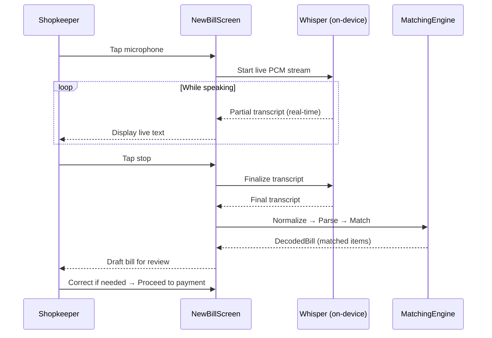

# RetailMind AI

An offline-first, AI-powered retail management app for small Indian shops. Combines **voice-driven billing**, inventory management, customer ledger (Khata), and cloud sync — all running on-device with no internet required for core operations.

Built for Malayalam- and English-speaking retailers who want fast, hands-free billing.

## Features

### Voice Billing
- **Live transcription** — see words appear in real-time as you speak; no waiting for a loading screen.
- **Multi-item voice input** — say all items and quantities in one go, in Malayalam or English.
- **Smart product matching** — a 4-strategy engine (exact → alias → fuzzy Levenshtein → phonetic Soundex) maps spoken words to your catalogue.
- **Transcript normalization** — handles Whisper hallucinations, filler words, and converts number words (English, Malayalam, Hindi) to digits automatically.
- **Draft bill review** — always shows the proposed bill for correction before finalizing.

### Inventory Management
- Full product CRUD with multilingual names, aliases, categories, brands, units, and GST percentages.
- Automatic stock deduction on bill completion.
- Low-stock alerts with configurable threshold.
- Search across name, Malayalam name, brand, category, and aliases.

### Payments & Customer Ledger (Khata)
- Three payment modes: **Cash**, **UPI**, **Pay Later**.
- Pay Later automatically creates a customer ledger entry and tracks pending balances.
- Customer management with payment history and ledger entries.

### Offline-First Architecture
- All data lives in a local **SQLite** database — the app works fully without internet.
- When connectivity is restored, data syncs to **Supabase** automatically.
- Supabase-based email/password authentication for multi-device cloud sync.

## Technology Stack

| Component | Technology |
|---|---|
| **Framework** | Flutter (Dart) |
| **Speech-to-Text** | `whisper_ggml` v2.4.0 — on-device whisper.cpp v1.9.1 |
| **Live Transcription** | `transcribeLive` with PCM16 streaming via the `record` package |
| **Local Database** | `sqflite` (5 tables: products, bills, bill\_items, customers, customer\_ledger) |
| **Cloud Backend** | Supabase (Auth + Postgres) |
| **Sync** | `connectivity_plus` — auto-sync on reconnect |
| **Platform** | Android (primary), iOS (supported) |

### Whisper Models

| Language | Model | Tier | Rationale |
|---|---|---|---|
| English | `WhisperModel.base` | Base (~142 MB) | Best speed/accuracy balance for English |
| Malayalam | `WhisperModel.small` | Small (~466 MB) | Better multilingual capacity needed for regional languages |

## Voice Billing Workflow


```mermaid
sequenceDiagram
    participant U as Shopkeeper
    participant App as NewBillScreen
    participant W as Whisper (on-device)
    participant M as MatchingEngine

    U->>App: Tap microphone
    App->>W: Start live PCM stream
    loop While speaking
        W-->>App: Partial transcript (real-time)
        App-->>U: Display live text
    end
    U->>App: Tap stop
    App->>W: Finalize transcript
    W-->>App: Final transcript
    App->>M: Normalize → Parse → Match
    M-->>App: DecodedBill (matched items)
    App-->>U: Draft bill for review
    U->>App: Correct if needed → Proceed to payment
```

## Example Voice Commands

| Spoken (Malayalam) | Meaning |
|---|---|
| `രണ്ട് പാൽ ഒരു ബ്രെഡ്` | 2 milk, 1 bread |
| `മൂന്ന് പഞ്ചസാര` | 3 sugar |

| Spoken (English) | Meaning |
|---|---|
| `two milk one bread three sugar` | 2 milk, 1 bread, 3 sugar |
| `half dozen eggs` | 6 eggs |

## Project Structure

```
lib/
├── main.dart                       # App entry, auth gate, home, billing screens
├── config/
│   └── supabase_config.dart        # Supabase URL + anon key
├── data/
│   ├── database_helper.dart        # SQLite CRUD, transactions, seed logic
│   └── product_catalog.dart        # Initial seed catalogue
├── models/
│   ├── product.dart                # Product with aliases, embeddings, GST
│   ├── bill.dart                   # Bill header
│   ├── bill_item.dart              # Line items
│   ├── customer.dart               # Customer record
│   └── customer_ledger.dart        # Khata payment entries
├── screens/
│   ├── login_screen.dart           # Email/password auth
│   ├── products_screen.dart        # Product list with search
│   ├── add_edit_product_screen.dart # Product form
│   ├── customers_screen.dart       # Customer list + ledger
│   └── payment_screen.dart         # Cash / UPI / Pay Later
└── services/
    ├── audio_recording_service.dart # Mic recording (WAV + PCM stream)
    ├── auth_service.dart           # Supabase auth wrapper
    ├── whisper_model_service.dart   # Model path management
    ├── voice_bill_decoder.dart     # Audio → transcript → bill pipeline
    ├── transcript_normalizer.dart  # Cleanup, filler removal, number conversion
    ├── quantity_parser.dart        # Extract qty + product text from segments
    ├── matching_engine.dart        # 4-strategy product matching
    └── sync_service.dart           # Offline-first Supabase sync
```

## Getting Started

1. **Clone** the repo and run `flutter pub get`.
2. **Configure Supabase** — add your URL and anon key in `lib/config/supabase_config.dart`.
3. **Models** — Whisper models auto-download on first use. For fully offline use, place GGML model files in `assets/models/`.
4. **Run** on a physical Android device: `flutter run --release` (release mode recommended for Whisper performance).

## Security

- Cleartext network traffic blocked on Android; ATS enabled on iOS.
- API keys excluded from Git.
- Supabase anon key used only for auth; row-level security enforced server-side.
- See [docs/security.md](docs/security.md) for the full security baseline.

## License

MIT — see [LICENSE](LICENSE).
